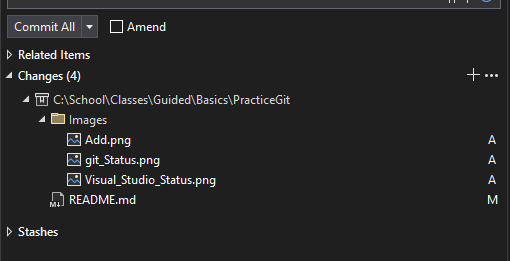

# PracticeGit

## Prepwork Space

* Open Readme.md : Including in project, look in Solution Explorer
* Terminal : View -> Terminal
	* Appears Below
* GitHub Changes : View -> Github Changes
	* Appears to the Right

	

## In the end
You will know how to use git to  
* Commit and Push Changes online
* Create Branches
* Switch Between Branches
* Merge Branches

using command line.

## Step by Step

1. ***git status***  
Git tracks changes to your project as you save.  

---
Type your name below   

> What's your name? :   

And save the file ( ctrl + s )

--- 
In the terminal type 

`git status`

Example : `C:\MySchoolProjects\Git_Project\git status`

***Result***

Git status shows us files that have been changed / saved since the last commit.

### What Visual Studio Sees

Look at your Git Changes window we opened earlier. You can see the same information as git status. Our README.md is located under `changes`.

Keep an eye on your Git Changes window to see whats happening as we work.

Lets stage our files to get ready to commit.

---
2. ***git add \****

After you've made changes to your project, you need to tell git what changes you want to commit. This is called ***Staging***.

Notice with our `git status`, README.md is in red, that means it is not staged. To stage it, in terminal type

`git add *`

---
## Keywords
* `git` - Used to access git commands
	* `git <command> <paremeter>`

### Commands

Git status
* `status` - view which files have changed
	* `git status`
Commiting and Pushing your changes
* `add *` - Stage your current changes
	* `git add *`  
* `commit -m "Message"` - Commit your current changes with your "Message"
	* `git commit -m "Your Message"`
* `push` - Push your local commits to Github
	* `git push`

---
Working with Branches
* `branch` - Displays all branches ( current branch in green )
	* `git branch`
* `checkout -b BranchName` - Creates a new branch and switches to it
	* `git checkout -b MyNewBranch`
* `checkout branchName` - Switch between branches
	* `git checkout main` - switch to main branch
* `merge branchToMerge` - Merge a different branch into current branch
	* `git merge branchToMerge` 
